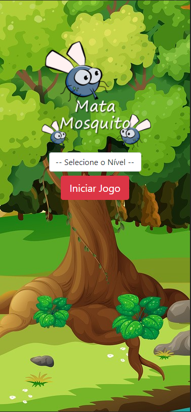
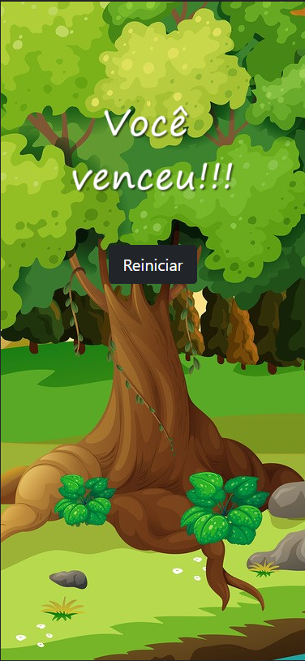
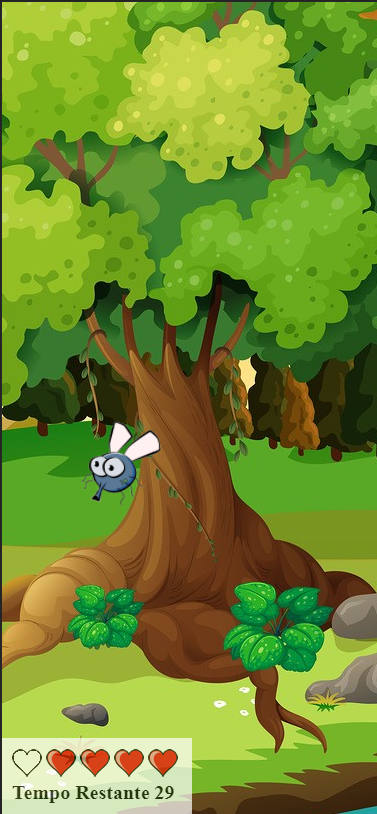
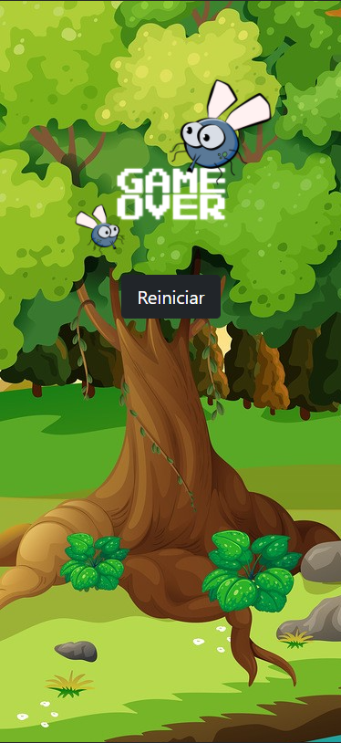

# 🦟Jogo - Mata Mosca🦟

 

# 🦟 Sobre o jogo

Um jogo versao mobile para testar sua velocidade e atenção, onde você escolhe dentre as dificuldade na aplicação que vão surgir moscas aleatoriamente na tela para você clicar nelas e eliminar.

 

# 📕 Como jogar

- Escolha uma dificuldade 🤔.
- Clique nas mosca para não perder suas 💖.
- Caso não sobre 💖, você perderar 😱.
- Voce ganha si sobreviver ate o tempo acabar 🏅.
- Divirta-se 😆.

 

# 🎮 GitPage

<a style="font-size: 18px" href="https://adelinojnr.github.io/jogo-mata-mosca/">Clica aqui para jogar</a>

 

# 💻 Tecnologias

  
  
  
  

 

# 📷 Imagens

  

    
    
  

  

    
    
  

# 🎥 Apresentação.

  

 

# 🙋🏻‍♂️ Autor

## Adelino Junior

